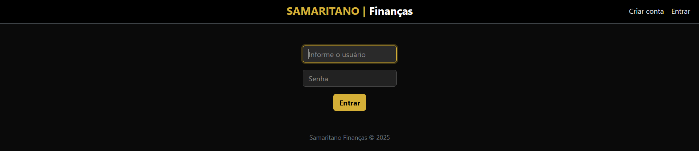
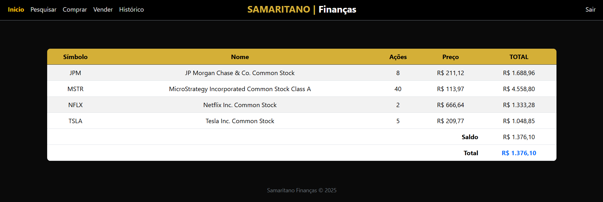
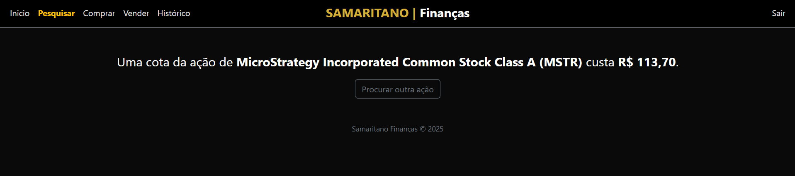
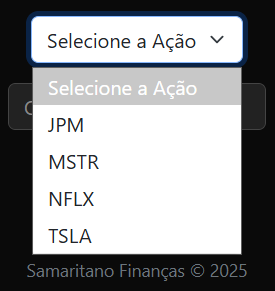
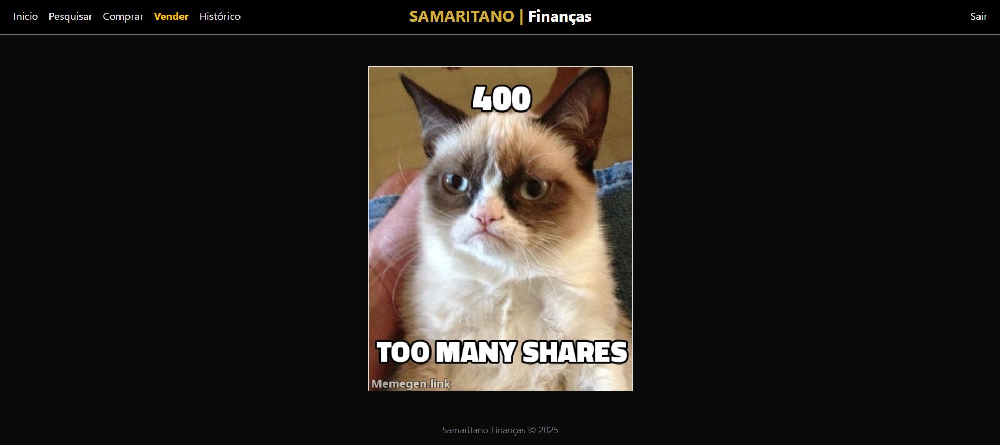

# Samaritano Finanças


Plataforma web de simulação de compra e venda de ações, permitindo que usuários criem contas, consultem cotações em tempo real, negociem ativos e acompanhem seu portfólio e histórico de transações.

O projeto foi desenvolvido com foco em lógica de negócio, organização backend e boas práticas de segurança em aplicações web.



## Visão Geral

A aplicação permite que cada usuário:
- Crie uma conta e faça login com autenticação segura
- Consulte preços atualizados de ações
- Compre e venda ativos
- Visualize seu portfólio consolidado
- Consulte o histórico completo de transações
- Gerencie saldo em dinheiro de forma persistente

Todo o fluxo é protegido por controle de sessão e validações no servidor.


---

## Funcionalidades Principais

- **Autenticação de usuários**
  - Hash de senha com `Werkzeug`
  - Sessões persistentes via `Flask-Session`

-  **Consulta de ativos**
  - Integração com API externa para obtenção de preços em tempo real

- **Compra e venda de ações**
  - Validação de saldo e quantidade
  - Registro de todas as operações no banco de dados

-  **Portfólio consolidado**
  - Cálculo dinâmico do valor total dos ativos
  - Exibição de saldo disponível e patrimônio total

- **Histórico de transações**
  - Registro completo de compras e vendas
  - Ordenação cronológica



## Arquitetura do Projeto

finance/

├── app.py # Rotas, regras de negócio e controle da aplicação

├── helpers.py # Funções auxiliares e decoradores

├── finance.db # Banco de dados SQLite

├── templates/ # Templates HTML (Jinja2)

├── static/ # Arquivos estáticos

└── requirements.txt # Dependências do projeto


---

## Modelo de Dados

### users
| Campo | Tipo | Descrição |
|-----|------|-----------|
| id | INTEGER | Identificador do usuário |
| username | TEXT | Nome de usuário único |
| hash | TEXT | Hash da senha |
| cash | NUMERIC | Saldo disponível |

### transactions
| Campo | Tipo | Descrição |
|------|------|-----------|
| id | INTEGER | Identificador da transação |
| user_id | INTEGER | Usuário relacionado |
| symbol | TEXT | Ativo negociado |
| shares | INTEGER | Quantidade (positivo ou negativo) |
| price | NUMERIC | Preço no momento da operação |
| timestamp | DATETIME | Data e hora |



## 🔒 Segurança e Boas Práticas

- Hash de senha (nunca armazenamento em texto puro)
- Validação rigorosa de entradas do usuário
- Proteção de rotas sensíveis com decoradores
- Separação de responsabilidades entre rotas e helpers

## Regras de Negócio Importantes

- Na aba **Vender**, o usuário visualiza apenas os ativos que já possui em carteira.

<p align="center">
  
</p>

<p align="center">
  <em>Tela de venda exibindo apenas ações disponíveis em carteira</em>
</p>

- O sistema impede a venda de uma quantidade maior de ações do que o usuário possui.
- Tentativas inválidas de compra ou venda exibem mensagens de erro personalizadas, incluindo uma página de erro temática do Grumpy Cat para melhorar a experiência do usuário.



---

## Como executar localmente

```bash
git clone https://github.com/bpb-bruno/samaritano-financas.git
cd samaritano-financas

python -m venv venv
source venv/bin/activate  # Windows: venv\Scripts\activate

pip install -r requirements.txt
flask run
```
A aplicação estará disponível em:
`http://127.0.0.1:5000`


## Tecnologias Utilizadas

- Python
- Flask
- SQLite
- Jinja2
- HTML / CSS
- Requests

## 🏗️ Demo

👉 [Acessar aplicação em produção](https://samaritano-financas.onrender.com/)

---
## Melhorias Futuras

- Implementar testes automatizados
- Adicionar paginação no histórico de transações
- Criar perfis públicos de portfólio
- Implementar autenticação via OAuth
- Melhorar observabilidade e logs
- Migrar banco de dados para PostgreSQL
---

## 👤 Autor

Desenvolvido por [**Bruno P.**](https://github.com/bpb-bruno) | Email: [contato@brunopbrito.com.br](mailto:contato@brunopbrito.com.br)
